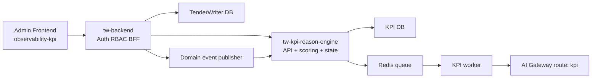

# Specifica Esecutiva Finale: `tw-kpi-reason-engine`

## Obiettivo
Realizzare `tw-kpi-reason-engine` come sottosistema autonomo di domain observability per TenderWriter, capace di:

- calcolare KPI qualitativi `A1..A4`;
- calcolare KPI operativi `B1..B4`;
- derivare gli indici sintetici `Q` ed `E`;
- classificare la salute del tender in `Green`, `Amber`, `Red`;
- inferire lo stato analitico del tender `S0..S13`;
- esporre snapshot, diagnostica, trend, transizioni e forecast;
- alimentare la nuova sezione admin frontend `observability-kpi` tramite `tw-backend`.

## Obiettivi di Qualita'
Il target desiderato e' `10/10` su sei dimensioni:

- aderenza funzionale al PDF;
- qualita' del dato;
- explainability;
- production readiness;
- sicurezza;
- evolvibilita' architetturale.

## Decisioni Finali Congelate

### D1. Servizio separato
`tw-kpi-reason-engine` viene implementato come servizio separato da `tw-backend`.

Motivazione:
- il PDF descrive un motore analitico, non solo endpoint aggiuntivi;
- separa il modello transazionale dal modello analitico;
- consente evoluzione indipendente di prompt, formule, telemetria e forecast.

### D2. `tw-backend` come BFF unico
Il browser parla solo con `tw-backend`.

Motivazione:
- auth e RBAC restano centralizzati;
- il servizio KPI resta interno alla rete di backend;
- si evita duplicazione della logica di sicurezza lato frontend.

### D3. Doppio livello di stato
Si mantengono in parallelo:

- stato prodotto corrente: `draft`, `active`, `in_progress`, `submitted`, `won`, `lost`, `cancelled`;
- stato analitico KPI: `S0..S13` e `Green/Amber/Red`.

Motivazione:
- riduce il rischio di regressioni sul prodotto esistente;
- consente migrazione progressiva verso il modello del PDF.

### D4. Nuova unita' analitica `ContributionUnit`
Si introduce `ContributionUnit` come deliverable richiesto a un owner.

Motivazione:
- il PDF ragiona per contributi dipartimentali, review, rework e SLA;
- `ProposalSection` da sola non basta a modellare il processo operativo.

### D5. KPI operativi basati su telemetria canonica
`B1..B4` saranno considerati affidabili solo se alimentati da eventi di dominio strutturati.

Motivazione:
- i dati attuali del codebase non coprono in modo nativo SLA, call, rework e date pianificate vs reali;
- senza telemetria esplicita si ottengono score poco difendibili.

### D6. Explainability obbligatoria
Ogni KPI deve produrre almeno:

- `score`
- `confidence`
- `inputs_used`
- `evidence`
- `diagnostic_summary`
- `recommendation`
- `prompt_version` o `formula_version`
- `model_version` se coinvolge un LLM

Motivazione:
- senza spiegabilita' l'admin dashboard non e' credibile;
- il motore deve essere auditabile e confrontabile nel tempo.

### D7. Forecast progressivo
Il forecast parte rule-based e viene poi sostituito o calibrato con dati storici reali.

Motivazione:
- il PDF propone un'impostazione markoviana corretta;
- il dataset attuale non e' sufficiente per un modello statistico robusto fin dal primo giorno.

### D8. Backfill storico consentito ma etichettato
Il backfill dei tender esistenti e' supportato, ma ogni dato ricostruito va marcato come `reconstructed`.

Motivazione:
- consente di recuperare valore dagli storici;
- evita di confondere dato osservato con dato dedotto retroattivamente.

### D9. UI admin osservativa-operativa leggera nella v1
La UI admin `observability-kpi` supporta:

- lettura e drill-down;
- trigger di ricalcolo;
- export;
- note e acknowledge risk;
- nessun override diretto della fase analitica nella prima release.

Motivazione:
- massimizza utilita' senza introdurre una seconda fonte di verita' del workflow.

## Architettura Target

## Confini di Responsabilita'

### `tw-backend`
Responsabilita':
- auth e RBAC;
- CRUD transazionali tender/proposal/chat/admin;
- pubblicazione eventi di dominio;
- proxy API admin verso il motore KPI;
- graceful degradation se il motore KPI non risponde.

### `tw-kpi-reason-engine`
Responsabilita':
- ingestione eventi e sync tender;
- storage analitico dedicato;
- calcolo KPI;
- classificazione salute e stato analitico;
- diagnostica;
- forecast;
- replay/backfill;
- query read-only per dashboard e analisi.

## Modello di Dominio Da Introdurre

### Entita' applicative
- `Department`
- `ContributionUnit`
- `ContributionRequest`
- `ContributionSubmission`
- `ReviewCycle`
- `ReviewFinding`
- `ReworkAction`
- `ComplianceGate`
- `CallSession`
- `AttendanceRecord`
- `SLAPolicy`
- `TenderOutcome`

### Entita' analitiche del servizio KPI
- `KpiTenderMirror`
- `KpiDomainEvent`
- `KpiSnapshot`
- `KpiFinding`
- `KpiTransition`
- `KpiAnalysisJob`
- `KpiModelVersion`
- `KpiForecastSnapshot`

## Definizione Operativa di Contributo
Per il sistema, un contributo e' un deliverable richiesto a un owner organizzativo all'interno di un tender.

Puo' essere associato a:
- una o piu' `ProposalSection`;
- uno o piu' allegati;
- un testo redazionale;
- uno stato di review;
- una o piu' richieste di rework;
- una scadenza e uno SLA.

## Catalogo Eventi Canonici

### Eventi base
- `tender_created`
- `tender_document_ingested`
- `requirements_extracted`
- `proposal_created`
- `proposal_section_updated`
- `tender_submitted`
- `tender_outcome_recorded`

### Eventi operativi
- `contribution_request_created`
- `contribution_due_date_set`
- `contribution_received`
- `contribution_review_completed`
- `rework_requested`
- `rework_resolved`
- `compliance_gate_opened`
- `compliance_gate_passed`
- `compliance_gate_failed`
- `call_scheduled`
- `call_attendance_recorded`
- `sla_breached`

### Requisiti per ogni evento
Ogni evento deve avere:
- `event_id`
- `event_type`
- `external_tender_id`
- `occurred_at`
- `actor_id` se presente
- `source`
- `payload_json`
- `schema_version`
- idempotency key o regola equivalente

## KPI e Formule

### KPI qualitativi
- `A1` Completezza ai requisiti di gara
- `A2` Chiarezza e qualita' redazionale
- `A3` Valore tecnico e competitivita'
- `A4` Rischio di non conformita' dell'offerta

### KPI operativi
- `B1` Rispetto delle deadline
- `B2` Responsivita' operativa
- `B3` Partecipazione alle call di gara
- `B4` Stabilita' del contributo

### Indici sintetici
- `Q = 0.30*A1 + 0.15*A2 + 0.30*A3 + 0.25*A4`
- `E = 0.30*B1 + 0.30*B2 + 0.15*B3 + 0.25*B4`

## Salute e Stato Analitico

### Classi di salute
- `Green`: `Q >= 7.5`, `E >= 7.0`, `A4 >= 7`
- `Amber`: `Q` tra `6.0` e `7.4` oppure `E` tra `5.0` e `6.9`
- `Red`: `A4 < 7` oppure forte degrado operativo

### Stati analitici
- `S0` Intake Opportunita'
- `S1` Go / No-Go
- `S2` Bid Planning
- `S3` Request Contributi
- `S4` Coordinamento & Ricezione
- `S5` Review Qualita' / Tecnica
- `S6` Rework / Chiarimenti
- `S7` Draft Integrato
- `S8` Gate Compliance / Approvazione
- `S9` Sottomissione
- `S10` Chiarimenti Post-Submission
- `S11` Win
- `S12` Loss
- `S13` Excluded / Withdrawn / No-Bid

### Principio di inferenza
Lo stato analitico e' funzione di:
- eventi recenti;
- KPI correnti;
- stato prodotto corrente;
- regole di transizione;
- eventuali assorbimenti terminali.

## Strategia di Calcolo

### Deterministico dove possibile
Da implementare con logica di regole e formule:
- `B1`
- `B2`
- `B3`
- `B4`
- `Q`
- `E`
- prima classificazione salute

### LLM dove serve ragionamento semantico
Da implementare con output JSON rigido:
- `A1`
- `A2`
- `A3`
- `A4`
- diagnostica testuale e raccomandazioni

### Requisiti obbligatori del layer LLM
- prompt versionati;
- schema JSON validato server-side;
- salvataggio raw result facoltativo ma tracciato;
- retry controllato;
- fallback a stato `analysis_failed` se il parsing non e' valido.

## Storage e Persistenza

### Regola architetturale
Il motore KPI non usa il DB di TenderWriter come sorgente analitica primaria in runtime.

### Scelta adottata
- servizio KPI con DB proprio;
- stessa istanza PostgreSQL ammessa in fase iniziale, ma con schema e credenziali dedicate;
- progettazione compatibile con futura separazione fisica completa.

### Tabelle minime
- `kpi_tenders`
- `kpi_domain_events`
- `kpi_analysis_jobs`
- `kpi_snapshots`
- `kpi_findings`
- `kpi_phase_transitions`
- `kpi_model_versions`
- `kpi_forecast_snapshots`

## API Ufficiali del Servizio KPI

### Ingestione
- `POST /v1/tenders`
- `POST /v1/tenders/{externalTenderId}/events`
- `POST /v1/tenders/{externalTenderId}/documents/context`
- `POST /v1/tenders/{externalTenderId}/analysis-jobs`

### Query
- `GET /v1/tenders/{externalTenderId}/snapshot`
- `GET /v1/tenders/{externalTenderId}/diagnostics`
- `GET /v1/tenders/{externalTenderId}/transitions`
- `GET /v1/tenders/{externalTenderId}/forecast`
- `GET /v1/admin/portfolio/overview`
- `GET /v1/admin/portfolio/bottlenecks`

### Regole API
- versioning obbligatorio;
- idempotenza sugli endpoint di ingestione;
- correlation id propagato;
- error model consistente;
- timeout stretti per query e piu' permissivi per job async.

## Sicurezza
- il servizio KPI e' accessibile solo sulla rete interna;
- autenticazione service-to-service con secret dedicato;
- nessuna chiamata diretta dal frontend;
- audit log per richieste admin sensibili;
- note e acknowledge risk sempre tracciati con `actor_id` e timestamp.

## Production Readiness: Requisiti Minimi
- migrazioni reali per il servizio KPI;
- healthcheck e readiness check;
- logging strutturato;
- metriche applicative;
- alert su error rate, timeout, job backlog e parsing LLM failed;
- retry controllato tra `tw-backend` e servizio KPI;
- graceful degradation lato `tw-backend`;
- runbook di replay e backfill;
- golden dataset di test KPI;
- test end-to-end su flussi chiave.

## UI Admin `observability-kpi`

### Vista Portfolio
- distribuzione tender per `S0..S13`;
- distribuzione salute `Green/Amber/Red`;
- tender piu' critici per `A4`, `E`, rework e SLA;
- bottleneck per dipartimento.

### Vista Tender Drilldown
- scorecard KPI completa;
- trend snapshot;
- stato analitico e salute;
- findings, evidenze e raccomandazioni;
- transizioni recenti;
- trigger ricalcolo.

### Vista Forecast
- percorso piu' probabile;
- probabilita' submit/rework/stop;
- confidence del forecast;
- spiegazione dei driver.

## Sequenza di Implementazione Raccomandata
1. congelare dominio, eventi e contratti;
2. bootstrap del servizio KPI;
3. pubblicazione eventi base da `tw-backend`;
4. sync tender e persistenza eventi;
5. primi snapshot e KPI qualitativi;
6. introduzione telemetria operativa;
7. classificazione stato analitico e salute;
8. UI admin;
9. forecast rule-based;
10. hardening produzione.

## Criteri di Accettazione Finali
- il servizio KPI e' deployabile in autonomia;
- `tw-backend` puo' pubblicare eventi e leggere snapshot;
- la dashboard admin legge dati reali dal backend;
- ogni snapshot e' spiegabile e versionato;
- i KPI operativi sono distinti tra `measured` e `inferred`;
- il forecast mostra confidence;
- il sistema degrada bene se il servizio KPI non e' disponibile;
- il replay storico e' supportato senza alterare il dato osservato.

## Cosa Serve Per Arrivare a 10/10
- telemetria canonica completa;
- explainability completa su ogni score;
- modello stato/forecast basato su eventi, non su scorciatoie;
- osservabilita' operativa del servizio;
- test automatici e golden dataset;
- gestione pulita di versioni formula, prompt e output.
