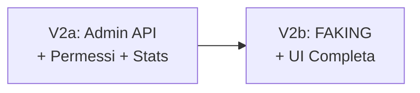

# 🛡️ TW-Anonymizer — Piano d'Azione V1 / V2 / V3

> **Data**: 22 Marzo 2026  
> **Progetto**: TenderWriter — Privacy Gateway per RAG Pipeline  
> **Fonti**: [anonymizer_spec.md](file:///media/marco/DATA2/progettiAi/tenderwriter/resoningfromagentic/antigravity/anonymizer_spec.md) + [anonymizer_analysis_review_finale.md](file:///media/marco/DATA2/progettiAi/tenderwriter/resoningfromagentic/antigravity/anonymizer_analysis_review_finale.md)

---

## Decisioni Architetturali Confermate

| # | Decisione | Stato |
|---|-----------|-------|
| 1 | **Presidio + spaCy** come baseline NER (Piiranha escluso dal baseline per licenza CC-BY-NC-ND-4.0) | ✅ Confermato |
| 2 | Punto di integrazione: **[backend/app/rag/engine.py](file:///media/marco/DATA2/progettiAi/tenderwriter/backend/app/rag/engine.py)** (non `generator.py`) | ✅ Confermato |
| 3 | **Security-first fallback**: anonymizer down → LLM interno, interno down → fail closed | ✅ Confermato |
| 4 | `tw-anonymizer` mantiene **relay SSRF-protected** + nuovi endpoint semantici | ✅ Confermato |
| 5 | Default: **REDACTION** con placeholder `[PERSONA_1]`, `[CF_1]`, etc. | ✅ Confermato |
| 6 | Reverse mapping in **Redis con TTL** (DB 1, separato da Celery su DB 0) | ✅ Confermato |
| 7 | Flag **globale** `ANONYMIZER_ENABLED` (V1), override per-target in V3 | ✅ Confermato |
| 8 | CIG: recognizer custom, default **OFF** (identificatore di dominio, non PII classico) | ✅ Confermato |
| 9 | Deanonymize: **solo admin/internal/debug**, mai nel flusso utente standard | ✅ Confermato |
| 10 | Gateway resta **routing layer**, backend gestisce la semantica di anonimizzazione | ✅ Confermato |

---

## Matrice Comportamentale

| Scenario | `anonymizer_enabled` | Anonymizer Status | LLM Usata | Dati escono? |
|----------|---------------------|-------------------|-----------|-------------|
| Default (off) | `false` | n/a | `tw-llama-tender` (interno) | ❌ No |
| Anonymizer ON + OK | `true` | ✅ Online | LLM esterna configurata | ✅ Solo anonimizzati |
| Anonymizer ON + KO | `true` | ❌ Down | `tw-llama-tender` (fallback) | ❌ No — Security fallback |
| Anonymizer ON, no External LLM | `true` | ✅ Online | `tw-llama-tender` (interno) | ❌ No |
| Anonymizer ON + KO + Interno KO | `true` | ❌ Down | Nessuno | ❌ **Fail Closed** |

> [!CAUTION]
> **Invariante di sicurezza**: Se `anonymizer_enabled=true` e l'anonymizer non è raggiungibile, il sistema **DEVE** fare fallback su `tw-llama-tender` interno. MAI inviare dati in chiaro a LLM esterne. Se anche l'interno non è disponibile → **fail closed**.

---

# 🟢 V1 — Sicurezza e Funzionamento Minimo Serio

## Obiettivo
> Prima rendi **impossibile il leak**. Portare `tw-anonymizer` da relay minimale a privacy gateway realmente operativo.

## Scope V1

**Entra:**
- `POST /v1/anonymize` funzionante
- Redis vault con TTL per reverse mapping
- Placeholder deterministici: `[PERSONA_1]`, `[CF_1]`, `[IBAN_1]`, `[PIVA_1]`
- Recognizer strutturati italiani: **CF, PIVA, IBAN**
- Presidio come orchestratore + spaCy come NER generale
- Integrazione nel flusso RAG (prima della generazione)
- Fallback **obbligatorio** su `tw-llama-tender` se anonymizer non disponibile
- Flag globale `ANONYMIZER_ENABLED=false` di default
- Relay SSRF-protected legacy preservato

**Non entra:**
- ❌ Faking/Faker
- ❌ Admin UI completa
- ❌ Policy per-progetto/query
- ❌ Deanonymize nel flusso utente
- ❌ Piiranha in produzione
- ❌ Audit console evoluta
- ❌ CIG (opzionale, può entrare tardi in V1 o in V2)

## Criterio di Successo
- I chunk verso LLM esterne escono **solo** se anonimizzati
- Se l'anonymizer fallisce → sistema usa LLM interno
- **Zero leak silenzioso** verso servizi esterni

---

### Sprint 1: Foundation — Core Anonymizer Service

> [!IMPORTANT]
> Questo sprint crea il servizio autonomo di anonimizzazione. Nessuna modifica al backend.

| # | File | Intervento | Effort | Rischio |
|---|------|-----------|--------|---------|
| 1 | `anonymizer/config.py` | **NUOVO** — Settings con Pydantic: `redis_url`, `host`, `port`, `ner_backend`, `default_config` (entities, TTL, strategy, min_confidence) | S | Basso |
| 2 | `anonymizer/recognizers/__init__.py` | **NUOVO** — Package init | S | Basso |
| 3 | `anonymizer/recognizers/italian.py` | **NUOVO** — Recognizer regex custom: `CodiceFiscaleRecognizer`, `PartitaIvaRecognizer`, `IBANRecognizer`, `CIGRecognizer` | M | Medio |
| 4 | `anonymizer/strategies.py` | **NUOVO** — Enum `AnonymizationStrategy` (REDACTION/FAKING), `ENTITY_LABELS` mapping, `FakingOperator` (skeleton per V2) | S | Basso |
| 5 | `anonymizer/vault.py` | **NUOVO** — Redis async vault: `store_session()`, `get_session()`, `load_config()`, `save_config()`, `update_stats()` | M | Medio |
| 6 | `anonymizer/engine.py` | **NUOVO** — Core engine: Presidio AnalyzerEngine + spaCy NER, `anonymize_text()`, `deanonymize_text()`, `AnonymizedChunk` dataclass | L | **Alto** |
| 7 | [anonymizer/app.py](file:///media/marco/DATA2/progettiAi/tenderwriter/anonymizer/app.py) | **EVOLUZIONE** — Aggiungere `POST /v1/anonymize`, `POST /v1/deanonymize`, `GET /v1/config`, `POST /v1/config`, `GET /v1/stats`. Mantenere relay `/{path:path}` e `/health` | M | Medio |
| 8 | [anonymizer/requirements.txt](file:///media/marco/DATA2/progettiAi/tenderwriter/anonymizer/requirements.txt) | **AGGIORNAMENTO** — Aggiungere: `presidio-analyzer`, `presidio-anonymizer`, `spacy`, `redis[asyncio]`, `structlog`, `pydantic-settings` | S | Medio |
| 9 | [anonymizer/Dockerfile](file:///media/marco/DATA2/progettiAi/tenderwriter/anonymizer/Dockerfile) | **AGGIORNAMENTO** — Install dipendenze NLP + download model `it_core_news_lg` a build time | M | Medio |
| 10 | [anonymizer/test_anonymizer.py](file:///media/marco/DATA2/progettiAi/tenderwriter/anonymizer/test_anonymizer.py) | **ESPANSIONE** — Test: anonymize semplice, mapping coerente, stesso valore → stesso placeholder, session scaduta, overlapping entities, recognizer italiani | M | Medio |

**Ordine di implementazione suggerito:**
```
config.py → recognizers/ → strategies.py → vault.py → engine.py → app.py → requirements.txt → Dockerfile → test
```

---

### Sprint 2: Backend Integration

> [!IMPORTANT]
> Questo sprint collega l'anonymizer al flusso RAG. È la modifica più critica lato sicurezza.

| # | File | Intervento | Effort | Rischio |
|---|------|-----------|--------|---------|
| 1 | [backend/app/config.py](file:///media/marco/DATA2/progettiAi/tenderwriter/backend/app/config.py) | **MODIFICA** — Aggiungere: `anonymizer_enabled`, `anonymizer_url`, `anonymizer_timeout`, `external_llm_url`, `external_llm_model` | S | Basso |
| 2 | [backend/app/rag/engine.py](file:///media/marco/DATA2/progettiAi/tenderwriter/backend/app/rag/engine.py) | **MODIFICA CRITICA** — Nuovi tipi `LLMRoute`, `AnonymizerUnavailableError`. Funzioni `_anonymize_chunks()`, `_deanonymize_text()`. Modifica `query()`: Step 3.5 Anonymize + Step 5.5 De-anonymize. Modifica `_generate()` per accettare generator parametrico. Aggiornamento `RAGResponse` con `llm_route` e `anonymized` | L | **Alto** |
| 3 | `backend/app/api/anonymizer_admin.py` | **NUOVO** — Router admin: `GET /api/anonymizer/config`, `POST /api/anonymizer/config`, `GET /api/anonymizer/stats`, `POST /api/anonymizer/test`. Admin-only con auth check | M | Medio |
| 4 | [backend/app/main.py](file:///media/marco/DATA2/progettiAi/tenderwriter/backend/app/main.py) | **MODIFICA** — Registrare router `anonymizer_admin` con prefix `/api/anonymizer` | S | Basso |
| 5 | [.env](file:///media/marco/DATA2/progettiAi/tenderwriter/.env) | **MODIFICA** — Aggiungere: `ANONYMIZER_ENABLED`, `ANONYMIZER_URL`, `ANONYMIZER_TIMEOUT`, `EXTERNAL_LLM_URL`, `EXTERNAL_LLM_MODEL` | S | Basso |
| 6 | [docker-compose.yml](file:///media/marco/DATA2/progettiAi/tenderwriter/docker-compose.yml) | **MODIFICA** — env per anonymizer (`ANONYMIZER_REDIS_URL`, `ANONYMIZER_NER_BACKEND`), env per backend (forwarding variabili anonymizer), depends_on Redis | S | Basso |
| 7 | `backend/tests/` | **NUOVO** — Test e2e: route esterna + anonymizer OK, route esterna + anonymizer down → fallback interno, route interna + anonymizer enabled → nessuna call, timeout stretto, fail closed | M | **Medio** |

**Ordine di implementazione suggerito:**
```
config.py → engine.py (core) → anonymizer_admin.py → main.py → .env → docker-compose.yml → test
```

---

### Sprint 3: Hardening & Polish

| # | Area | Intervento | Effort | Rischio |
|---|------|-----------|--------|---------|
| 1 | Logging/Observability | Loggare `anonymizer_used`, `llm_route`, `session_token` (server-only), fallback events | S | Basso |
| 2 | Limiti input | `max_chunks`, `max_chunk_chars` nell'anonymizer | S | Basso |
| 3 | Timeout & retries | Timeout stretto (8s), circuit behavior basico | S | Medio |
| 4 | `query_stream()` nota | **NON** coperto in V1. Decisione: accumulare stream in buffer, de-anonimizzare alla fine | — | Nota |
| 5 | Documentazione | `anonymizer/README.md` con API contract e deployment notes | S | Basso |

---

### Riepilogo V1

| Metrica | Valore |
|---------|--------|
| **Effort totale stimato** | **6–10 giorni effettivi** |
| **Rischio complessivo** | **Medio-Alto** |
| **File nuovi** | ~8 file |
| **File modificati** | ~6 file |
| **Punto più critico** | `anonymizer/engine.py` (cuore NER) + `backend/app/rag/engine.py` (enforcement privacy) |

---

# 🟡 V2 — Governabilità e Usability Admin

## Obiettivo
> Poi rendi il sistema **governabile**. L'admin deve poter configurare, testare e monitorare il modulo.

## Scope V2

**Entra:**
- Admin API dedicate: `/anonymizer/config`, `/anonymizer/stats`, `/anonymizer/test`
- Admin UI nella sezione Impostazioni
- Attivazione/disattivazione entità da mascherare
- Soglia di confidence configurabile
- TTL sessione configurabile
- Area test: incolla testo → vedi output anonimizzato
- `POST /v1/deanonymize` **solo admin/test/audit**
- **FAKING** come strategia opzionale accanto a REDACTION
- CIG come recognizer opzionale configurabile
- Metriche base: entità rilevate, sessioni create, fallback events

## Criterio di Successo
- L'admin governa davvero il modulo
- Può testare la resa in tempo reale
- Può scegliere **REDACTION** o **FAKING**
- Il deanonymize è confinato a uso interno e controllato

---

### Dettaglio File V2

| # | File / Area | Intervento | Effort | Rischio |
|---|-------------|-----------|--------|---------|
| 1 | `anonymizer/strategies.py` | **EVOLUZIONE** — Implementare `FakingOperator` completo con pool dati sintetici coerenti, consistenza intra-sessione | M | **Alto** |
| 2 | `anonymizer/engine.py` | **EVOLUZIONE** — Supportare strategy configurabile (`redact`/`fake`), deanonymize admin-only con compatibilità V1 | M | Medio |
| 3 | `anonymizer/app.py` | **EVOLUZIONE** — Endpoint admin: config read/write, stats, test, deanonymize con audit | M | Medio |
| 4 | `anonymizer/schemas.py` | **EVOLUZIONE** — Modelli admin config, stats, test, deanonymize | S | Basso |
| 5 | `anonymizer/recognizers/italian.py` | **EVOLUZIONE** — CIG recognizer con flag `mask_cig` configurabile, default OFF | S | Medio |
| 6 | `backend/app/api/anonymizer_admin.py` | **EVOLUZIONE** — API di supporto admin, proxy verso anonymizer service | M | Medio |
| 7 | [frontend/src/api/client.ts](file:///media/marco/DATA2/progettiAi/tenderwriter/frontend/src/api/client.ts) | **MODIFICA** — `anonymizerApi`: `getConfig()`, `updateConfig()`, `getStats()`, `test()` | S | Basso |
| 8 | [frontend/src/pages/Settings.tsx](file:///media/marco/DATA2/progettiAi/tenderwriter/frontend/src/pages/Settings.tsx) | **MODIFICA** — Card Anonymizer: toggle ON/OFF, strategy selector, slider confidenza, TTL input, checkboxes entità, stats display | L | Medio |
| 9 | Frontend — Area Test | Textarea + bottone "Test Anonimizzazione" + risultato preview anonimizzato | M | Medio |
| 10 | Authz/Permessi | Limitare `/v1/deanonymize` e config a soli admin, con audit log | M | **Alto** |
| 11 | Metriche | Stats su entità, sessioni, fallback, errori (base per dashboard V3) | S | Basso |
| 12 | Test | Coprire redact vs fake, admin-only deanonymize, CIG masked/unmasked | M | Medio |

---

### Sotto-fasi V2 Consigliate



**V2a** — Admin API + permessi + stats + CIG (rischio minore)  
**V2b** — FAKING + UI Settings completa + area test (rischio maggiore per semantica faking)

> [!WARNING]
> **Punto più rischioso V2**: il **FAKING** preserva meglio il contesto ma è più difficile da validare, può produrre drift semantico o falsi segnali per l'LLM.

---

### Riepilogo V2

| Metrica | Valore |
|---------|--------|
| **Effort totale stimato** | **7–12 giorni effettivi** |
| **Rischio complessivo** | **Medio** (UI), **Alto** (faking + permessi) |
| **Pre-requisito** | V1 stabile e testata |

---

# 🔴 V3 — Maturità Enterprise e Ottimizzazione

## Obiettivo
> Infine lo rendi **raffinato, misurabile e differenziato**. Da componente funzionante a componente maturo enterprise.

## Scope V3

**Entra:**
- Policy **per-progetto**, **per-target**, eventualmente **per-query**
- Recognizer di dominio ampliati: CUP, identificatori gara/lotto
- Audit trail strutturato e consultabile
- Golden dataset italiano dedicato per benchmark
- Benchmark qualitativo delle strategie
- NER backend pluggable maturo (valutazione Piiranha o alternativi)
- Regole differenziate per: internal only / external only / target specifici del gateway
- Osservabilità evoluta con dashboard e alerting
- `query_stream()` con de-anonimizzazione buffered
- Deanonymize governance avanzata (retention, access review)

## Criterio di Successo
- Comportamento differenziato per contesto
- Qualità misurabile su dataset reali
- Compliance e auditabilità forti
- Zero dipendenza da scelte "one size fits all"

---

### Dettaglio File V3

| # | File / Area | Intervento | Effort | Rischio |
|---|-------------|-----------|--------|---------|
| 1 | Policy Engine | **NUOVO** — Policy per progetto/target/query, regole di routing privacy differenziate | L | **Alto** |
| 2 | `anonymizer/recognizers/` | **EVOLUZIONE** — Espansione recognizer dominio: CUP, ID gara, ulteriori identificatori | M | Medio |
| 3 | Benchmark Suite | **NUOVO** — Golden dataset italiano, test qualitativi recall/precision su corpus TenderWriter reale | L | Medio |
| 4 | NER Backend Abstraction | **EVOLUZIONE** — Backend pluggable maturo, interfaccia per modelli diversi | M | Medio |
| 5 | Model Evaluation | Valutazione Piiranha o alternativi su corpus reale (post-verifica licenza) | M | **Alto** |
| 6 | Audit Trail | **NUOVO** — Eventi strutturati, consultazione audit, retention policies | L | **Alto** |
| 7 | Dashboard | **NUOVO** — Dashboard metriche, alerting, trend qualità NER | M | Medio |
| 8 | Gateway Integration | **EVOLUZIONE** — Regole privacy per target/provider specifici, override per-route | M | Medio |
| 9 | `query_stream()` | **EVOLUZIONE** — De-anonimizzazione buffered dello stream token-by-token | M | **Alto** |
| 10 | Deanonymize Governance | **EVOLUZIONE** — Controlli avanzati, retention, access review | M | **Alto** |
| 11 | Documentazione/Runbook | Playbook operativi, incident flow, tuning guide | S | Basso |

---

### Riepilogo V3

| Metrica | Valore |
|---------|--------|
| **Effort totale stimato** | **10–18 giorni effettivi** |
| **Rischio complessivo** | **Medio-Alto** |
| **Pre-requisito** | V2 stabile + settimane di uso reale con dati concreti |

> [!TIP]
> La V3 va attivata **solo dopo uso reale** del sistema, quando si hanno esempi concreti di: falsi positivi, falsi negativi, casi di routing multi-provider, necessità di audit più forte.

---

# 📊 Vista Sinottica Completa

## Per Versione

| Versione | Obiettivo | Effort | Rischio | ROI |
|----------|-----------|--------|---------|-----|
| **V1** | Sicurezza e funzionamento minimo serio | 6–10 gg | Medio-Alto | **Massimo** |
| **V2** | Governabilità e usability admin | 7–12 gg | Medio | Alto |
| **V3** | Maturità enterprise e ottimizzazione | 10–18 gg | Medio-Alto | Variabile |

## Per Priorità di Implementazione

| Priorità | Cosa fare | Perché |
|----------|-----------|--------|
| 🥇 **1** | `anonymizer/engine.py` + `recognizers/` + `app.py` | Senza questo non esiste il core |
| 🥈 **2** | `backend/app/rag/engine.py` | È il vero punto di enforcement privacy |
| 🥉 **3** | Test fallback / fail closed | Evita data leak silenziosi |
| **4** | Config + Compose + Dockerfile | Rende il tutto deployabile |
| **5** | UI/Admin/Faking (V2) | Valore alto, ma non blocca il rilascio sicuro |
| **6** | Policy engine / Audit (V3) | Enterprise, solo dopo uso reale |

## Backlog Riclassificato

| Voce | Origine | V1 | V2 | V3 |
|------|---------|:--:|:--:|:--:|
| `/v1/anonymize` | Analisi + Spec | ✅ | — | — |
| Redis TTL vault | Analisi + Spec | ✅ | — | — |
| Recognizer italiani (CF, PIVA, IBAN) | Analisi + Spec | ✅ | — | — |
| Fallback security-first | Analisi + Spec | ✅ | — | — |
| Integrazione `engine.py` | Analisi | ✅ | — | — |
| Flag globale on/off | Analisi | ✅ | — | — |
| CIG recognizer | Analisi | (opz.) | ✅ | — |
| Faking/Faker | Spec originale | ❌ | ✅ | — |
| Admin UI | Spec originale | ❌ | ✅ | — |
| Admin API config/stats/test | Spec | ❌ | ✅ | — |
| Deanonymize admin-only | Analisi | ❌ | ✅ | — |
| Policy per-progetto/query | Discusso | ❌ | ❌ | ✅ |
| Audit console evoluta | Non definita | ❌ | ❌ | ✅ |
| NER pluggable (Piiranha ecc.) | Condizionato | ❌ | ❌ | ✅ |
| Golden dataset benchmark | Analisi | ❌ | ❌ | ✅ |
| `query_stream()` deanonymize | Spec | ❌ | ❌ | ✅ |

---

## Pipeline del Flusso — Stato Finale

```
Query utente
  │
  ▼
Dense Retrieval → Sparse Retrieval → Graph Retrieval
  │
  ▼
Fusion → Rerank → [context_texts]
  │
  ├── anonymizer_enabled=false ────────────────────────┐
  │                                                     │
  ├── anonymizer_enabled=true                           │
  │     │                                               │
  │     ▼                                               │
  │   POST /v1/anonymize ──► session_token + chunks     │
  │     │                     anonimizzati               │
  │     ├── OK → LLM esterna ◄───────────────────┐     │
  │     │                                         │     │
  │     └── FAIL → fallback LLM interno ──────────┤     │
  │                                               │     │
  │                                               ▼     ▼
  └─────────────────────────────────────────► Generator
                                                  │
                                                  ▼
                                        [risposta grezza]
                                                  │
                                    ┌─────────────┤
                                    │ se session   │ se no session
                                    │ attiva       │
                                    ▼              ▼
                              Deanonymize     Risposta diretta
                                    │
                                    ▼
                              Risposta utente
                              (testo originale)
```

---

> [!NOTE]
> **Sequenza raccomandata**: chiudere tutta la **V1** prima di toccare UI o faking. Fare la **V2** in due sotto-passi (prima admin API, poi faking + UI). Usare la **V3** solo dopo settimane di uso reale.
