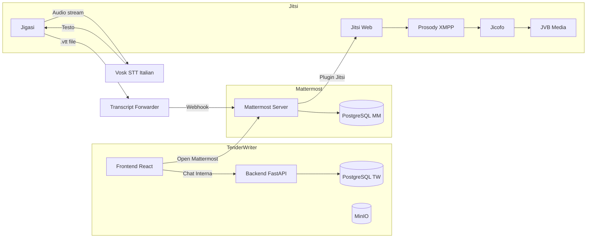

# Integrazione Video Call con Trascrizione: Mattermost + Jitsi + Jigasi + Vosk

## Contesto

TenderWriter ha attualmente una **chat interna** per ogni tender (rotta `/tenders/:id/chat`), basata su WebSocket/polling con storage MinIO. Il bottone **"Open Chat"** nella [TenderCard](file:///d:/tender/tenderwriter/frontend/src/pages/Dashboard.tsx#36-162) della Dashboard naviga direttamente a questa chat interna.

L'utente vuole aggiungere un **canale alternativo Mattermost** con videochiamata Jitsi + trascrizione automatica via Jigasi/Vosk, mantenendo anche la chat interna esistente.

---

## Validazione della Pre-Analisi (`VIDEO CALL.md`) dell'Utente

La pre-analisi è **solida e tecnicamente corretta**. Tuttavia, il docker-compose proposto è semplificato e va adattato all'ecosistema TenderWriter esistente. Ecco le correzioni e integrazioni:

### ✅ Punti validati
| Aspetto | Valutazione |
|---|---|
| Scelta Jitsi + Vosk (on-premise, zero costi) | ✅ Ottima |
| Jigasi come bridge audio → STT | ✅ Corretto |
| Flusso: Mattermost → Jitsi → Jigasi → Vosk → transcript | ✅ Coerente |
| Container Vosk `alphacep/kaldi-it` per italiano | ✅ Corretto |
| Salvataggio `.vtt` e invio tramite webhook | ✅ Approccio giusto |

### ⚠️ Criticità da risolvere nella pre-analisi

1. **Network**: la pre-analisi usa una rete isolata `jitsi-net`. Deve essere integrata nella rete `default` del docker-compose esistente oppure collegata a entrambe.
2. **Mattermost** non è presente nel docker-compose della pre-analisi — va aggiunto con il proprio PostgreSQL dedicato (non condiviso con TenderWriter).
3. **Variabili d'ambiente Jitsi** mancanti: `JICOFO_AUTH_PASSWORD`, `JVB_AUTH_PASSWORD`, `JIGASI_XMPP_PASSWORD`, `TZ`, ecc.
4. **Volumi persistenti** assenti per Mattermost.
5. **Script webhook** (Python o Bash) per uploadare le trascrizioni su Mattermost non è formalizzato.

---

## User Review Required

> [!IMPORTANT]
> **Porte esposte**: I nuovi servizi espongono diverse porte aggiuntive. Verifica che non ci siano conflitti con i servizi esistenti:
> - Mattermost: `8065`
> - Mattermost DB: `5433` (non 5432 per evitare conflitto con TW postgres)
> - Jitsi Web: `8880`/`8843`
> - JVB UDP: `10000/udp`

> [!IMPORTANT]
> **Risorse server**: Lo stack completo (Mattermost + 5 container Jitsi + Vosk) aggiunge ~3-4 GB RAM. Assicurati che il server abbia almeno **12 GB RAM totali**.

> [!WARNING]
> **Mattermost PostgreSQL separato**: Creerò un **secondo container PostgreSQL** dedicato a Mattermost (`mm-postgres`) per evitare contaminazione con il database TenderWriter. Questa è una best practice.

---

## Proposed Changes

### Infrastruttura Docker

#### [MODIFY] [docker-compose.yml](file:///d:/tender/tenderwriter/docker-compose.yml)

Aggiunta di **8 nuovi servizi** in fondo al file (prima della sezione `volumes:`):

**Blocco 1 — Mattermost**
```yaml
  # --- Mattermost (Team Chat + Video Integration) ---
  mm-postgres:
    image: postgres:16-alpine
    container_name: tw-mm-postgres
    restart: unless-stopped
    environment:
      POSTGRES_USER: ${MM_DBUSER:-mmuser}
      POSTGRES_PASSWORD: ${MM_DBPASS:-DefaultMM2024Pass}
      POSTGRES_DB: ${MM_DBNAME:-mattermost}
    volumes:
      - mm_postgres_data:/var/lib/postgresql/data
    healthcheck:
      test: ["CMD-SHELL", "pg_isready -U ${MM_DBUSER:-mmuser}"]
      interval: 10s
      timeout: 10s
      retries: 5

  mattermost:
    image: mattermost/mattermost-team-edition:latest
    container_name: tw-mattermost
    restart: unless-stopped
    depends_on:
      mm-postgres:
        condition: service_healthy
    environment:
      MM_SQLSETTINGS_DRIVERNAME: postgres
      MM_SQLSETTINGS_DATASOURCE: "postgres://${MM_DBUSER:-mmuser}:${MM_DBPASS:-DefaultMM2024Pass}@mm-postgres:5432/${MM_DBNAME:-mattermost}?sslmode=disable&connect_timeout=10"
      MM_SERVICESETTINGS_SITEURL: ${MM_SITE_URL:-http://localhost:8065}
      MM_PLUGINSETTINGS_ENABLEUPLOADS: "true"
    ports:
      - "${MM_PORT:-8065}:8065"
    volumes:
      - mm_data:/mattermost/data
      - mm_config:/mattermost/config
      - mm_logs:/mattermost/logs
      - mm_plugins:/mattermost/plugins
```

**Blocco 2 — Jitsi Core (Prosody, Jicofo, JVB, Web)**
```yaml
  # --- Jitsi Meet Stack ---
  jitsi-prosody:
    image: jitsi/prosody:stable-9823
    container_name: tw-jitsi-prosody
    restart: unless-stopped
    environment:
      JICOFO_AUTH_PASSWORD: ${JITSI_JICOFO_AUTH_PASSWORD:-changeme-jicofo}
      JVB_AUTH_PASSWORD: ${JITSI_JVB_AUTH_PASSWORD:-changeme-jvb}
      JIGASI_XMPP_PASSWORD: ${JITSI_JIGASI_XMPP_PASSWORD:-changeme-jigasi}
      PUBLIC_URL: ${JITSI_PUBLIC_URL:-http://localhost:8880}
      TZ: ${TZ:-Europe/Rome}
    volumes:
      - jitsi_prosody_cfg:/config:Z

  jitsi-jicofo:
    image: jitsi/jicofo:stable-9823
    container_name: tw-jitsi-jicofo
    restart: unless-stopped
    depends_on:
      - jitsi-prosody
    environment:
      JICOFO_AUTH_PASSWORD: ${JITSI_JICOFO_AUTH_PASSWORD:-changeme-jicofo}
      XMPP_SERVER: jitsi-prosody
      TZ: ${TZ:-Europe/Rome}
    volumes:
      - jitsi_jicofo_cfg:/config:Z

  jitsi-jvb:
    image: jitsi/jvb:stable-9823
    container_name: tw-jitsi-jvb
    restart: unless-stopped
    depends_on:
      - jitsi-prosody
    environment:
      JVB_AUTH_PASSWORD: ${JITSI_JVB_AUTH_PASSWORD:-changeme-jvb}
      XMPP_SERVER: jitsi-prosody
      PUBLIC_URL: ${JITSI_PUBLIC_URL:-http://localhost:8880}
      TZ: ${TZ:-Europe/Rome}
    ports:
      - "10000:10000/udp"
    volumes:
      - jitsi_jvb_cfg:/config:Z

  jitsi-web:
    image: jitsi/web:stable-9823
    container_name: tw-jitsi-web
    restart: unless-stopped
    depends_on:
      - jitsi-prosody
    environment:
      XMPP_SERVER: jitsi-prosody
      PUBLIC_URL: ${JITSI_PUBLIC_URL:-http://localhost:8880}
      ENABLE_TRANSCRIPTIONS: 1
      TZ: ${TZ:-Europe/Rome}
    ports:
      - "${JITSI_WEB_PORT:-8880}:80"
      - "${JITSI_WEB_SSL_PORT:-8843}:443"
    volumes:
      - jitsi_web_cfg:/config:Z
```

**Blocco 3 — Jigasi + Vosk**
```yaml
  # --- Vosk Speech-to-Text Server (Italian) ---
  vosk:
    image: alphacep/kaldi-it:latest
    container_name: tw-vosk
    restart: unless-stopped

  # --- Jigasi (Jitsi Audio Bridge → Vosk STT) ---
  jitsi-jigasi:
    image: jitsi/jigasi:stable-9823
    container_name: tw-jitsi-jigasi
    restart: unless-stopped
    depends_on:
      - vosk
      - jitsi-prosody
    environment:
      ENABLE_TRANSCRIPTIONS: 1
      JIGASI_TRANSCRIBER_ADVERTISE_URL: "true"
      XMPP_SERVER: jitsi-prosody
      JIGASI_XMPP_PASSWORD: ${JITSI_JIGASI_XMPP_PASSWORD:-changeme-jigasi}
      PUBLIC_URL: ${JITSI_PUBLIC_URL:-http://localhost:8880}
      TZ: ${TZ:-Europe/Rome}
    volumes:
      - jitsi_jigasi_cfg:/config:Z
      - jitsi_transcripts:/tmp/transcripts:Z
```

**Nuovi volumi da aggiungere** alla sezione `volumes:`:
```yaml
  mm_postgres_data:
  mm_data:
  mm_config:
  mm_logs:
  mm_plugins:
  jitsi_prosody_cfg:
  jitsi_jicofo_cfg:
  jitsi_jvb_cfg:
  jitsi_web_cfg:
  jitsi_jigasi_cfg:
  jitsi_transcripts:
```

---

#### [MODIFY] [.env](file:///d:/tender/tenderwriter/.env)

Aggiunta variabili per Mattermost e Jitsi:
```env
# --- Mattermost ---
MM_DBUSER=mmuser
MM_DBPASS=DefaultMM2024Pass
MM_DBNAME=mattermost
MM_PORT=8065
MM_SITE_URL=http://localhost:8065

# --- Jitsi Meet ---
JITSI_PUBLIC_URL=http://localhost:8880
JITSI_WEB_PORT=8880
JITSI_WEB_SSL_PORT=8843
JITSI_JICOFO_AUTH_PASSWORD=changeme-jicofo
JITSI_JVB_AUTH_PASSWORD=changeme-jvb
JITSI_JIGASI_XMPP_PASSWORD=changeme-jigasi
TZ=Europe/Rome
```

---

### Script di Automazione

#### [NEW] [transcript_forwarder.py](file:///d:/tender/tenderwriter/utility/transcript_forwarder.py)

Script Python che monitora la cartella `/tmp/transcripts` e invia i file `.vtt` a un canale Mattermost via **Incoming Webhook**. Sarà un semplice file-watcher con `watchdog` o polling.

---

### Frontend — Scelta Chat Mode

#### [MODIFY] [Dashboard.tsx](file:///d:/tender/tenderwriter/frontend/src/pages/Dashboard.tsx)

Il bottone "Open Chat" (linee 131-141) nel [TenderCard](file:///d:/tender/tenderwriter/frontend/src/pages/Dashboard.tsx#36-162) verrà trasformato in un **dropdown split-button** con due opzioni:
1. **💬 Chat Interna** → naviga a `/tenders/:id/chat` (comportamento attuale)
2. **📹 Mattermost + Video** → apre Mattermost in una nuova tab (`window.open`)

Il click principale rimane "Chat Interna" per comportamento di default, con una piccola freccia dropdown per l'opzione Mattermost.

---

## Architettura Risultante



---

## Verification Plan

### Automated Tests
1. **Docker Compose validation**:
   ```bash
   cd d:\tender\tenderwriter
   docker compose config --quiet
   ```
   Se esce senza errori, la sintassi è corretta.

2. **Nessun test unitario aggiuntivo** richiesto per le modifiche docker-compose e .env (sono infrastrutturali).

### Manual Verification
1. **Utente**: Dopo le modifiche, runnare `docker compose config` per validare la sintassi.
2. **Utente**: Avviare solo i nuovi servizi in sequenza per verificare che si avviano:
   ```bash
   docker compose up -d mm-postgres mattermost
   docker compose up -d jitsi-prosody jitsi-jicofo jitsi-jvb jitsi-web
   docker compose up -d vosk jitsi-jigasi
   ```
3. **Utente**: Verificare che Mattermost sia raggiungibile su `http://localhost:8065`.
4. **Utente**: Verificare che Jitsi Meet sia raggiungibile su `http://localhost:8880`.
5. **Utente**: Installare il plugin Jitsi in Mattermost e testare una chiamata.
6. **Utente**: Verificare che il dropdown nella Dashboard mostri le due opzioni chat.
