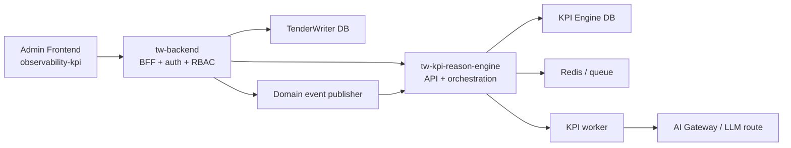

# Piano di Introduzione: `tw-kpi-reason-engine`

## Obiettivo
Introdurre in TenderWriter un nuovo modulo autonomo, `tw-kpi-reason-engine`, con API proprie e ciclo di vita indipendente, incaricato di:

- calcolare KPI qualitativi e operativi per ciascun tender;
- ricostruire lo stato esteso del tender (`fase + salute`);
- supportare forecast, observability e retrospective;
- esporre dati che `tw-backend` usera' per alimentare una nuova sezione admin frontend: `observability-kpi`.

## Fonti considerate
- Specifiche in `D:\tender\KPIReasonEngine.pdf`
- Architettura e codice attuale di TenderWriter

## Sintesi Esecutiva
Le specifiche non descrivono un semplice pannello KPI. Descrivono un motore di reasoning che unisce:

- 8 KPI di dominio:
  - `A1..A4` per qualita', competitivita' e compliance
  - `B1..B4` per efficienza operativa
- 2 indici sintetici:
  - `Q = 0.30*A1 + 0.15*A2 + 0.30*A3 + 0.25*A4`
  - `E = 0.30*B1 + 0.30*B2 + 0.15*B3 + 0.25*B4`
- una classificazione di salute:
  - `Green`
  - `Amber`
  - `Red`
- un modello di stato del tender molto piu' ricco dell'attuale:
  - da `S0` a `S13`
- una logica markoviana per stimare avanzamento, rework, blocco ed esito.

La conseguenza architetturale e' netta: il componente va progettato come servizio separato, non come semplice sottorouter dentro `tw-backend`.

## Lettura delle specifiche PDF

### KPI richiesti
Il PDF definisce due famiglie:

1. Qualita'
- `A1` Completezza ai requisiti di gara
- `A2` Chiarezza e qualita' redazionale
- `A3` Valore tecnico e competitivita'
- `A4` Rischio di non conformita' dell'offerta

2. Efficienza
- `B1` Rispetto delle deadline
- `B2` Responsivita' operativa
- `B3` Partecipazione alle call di gara
- `B4` Stabilita' del contributo

### Stato esteso richiesto
Il PDF propone un modello a stati discreti:

- `S0` Intake Opportunita'
- `S1` Go / No-Go
- `S2` Bid Planning
- `S3` Request Contributi
- `S4` Coordinamento & Ricezione
- `S5` Review Qualita' / Tecnica
- `S6` Rework / Chiarimenti
- `S7` Draft Integrato
- `S8` Gate Compliance / Approvazione
- `S9` Sottomissione
- `S10` Chiarimenti Post-Submission
- `S11` Win
- `S12` Loss
- `S13` Excluded / Withdrawn / No-Bid

Il punto piu' importante e' che il sistema non ragiona solo per fase, ma per stato esteso:

- `stato = fase + classe_salute`
- esempio:
  - `S4-G`
  - `S4-A`
  - `S4-R`

Questo e' il cuore del motore.

## AS-IS di TenderWriter

### Cosa esiste oggi
Nel codice attuale:

- `tw-backend` e' una singola app FastAPI che espone auth, tenders, proposals, admin, chat, system e tasks.
- Il frontend ha gia' un perimetro admin con rotte dedicate.
- Esiste una timeline chat/retrospective che registra `ChatEvent`, messaggi e attachment.
- Gli stati applicativi del tender sono oggi molto piu' semplici:
  - `draft`
  - `active`
  - `in_progress`
  - `submitted`
  - `won`
  - `lost`
  - `cancelled`

### Cosa manca rispetto al PDF
Mancano quasi del tutto:

- una granularita' di fase `S0..S13`;
- un event model di dominio per richieste contributi, ricezione, review, rework, gate, call, SLA;
- un repository storico dei KPI e delle transizioni;
- una matrice di transizione e il motore forecast;
- un perimetro API dedicato per observability tender.

### Conseguenza
Se incorporassimo tutto in `tw-backend`, il rischio sarebbe:

- accoppiare forte logica di reasoning, lifecycle tender e UI admin;
- rendere fragile l'evoluzione del modello markoviano;
- mischiare read model osservabile con write model transazionale del prodotto.

Per questo il nuovo modulo deve essere un bounded context separato.

## Raccomandazione Architetturale

### Scelta consigliata
Introdurre `tw-kpi-reason-engine` come microservizio interno con:

- API REST proprie;
- proprio storage applicativo;
- pipeline asincrona per analisi pesanti;
- contratto di integrazione esplicito con `tw-backend`;
- esposizione al browser solo tramite `tw-backend` come BFF.

### Perche' questa scelta
Permette di separare:

- il lifecycle operativo del prodotto;
- il motore di interpretazione KPI;
- il read model admin per observability.

Inoltre consente di far evolvere in modo indipendente:

- prompt LLM;
- formule di scoring;
- classi di salute;
- matrici di transizione;
- forecast e retrospective.

## Architettura Target



## Confini di Responsabilita'

### `tw-backend`
Responsabile di:

- autenticazione e RBAC verso il frontend;
- gestione transazionale di tender, proposal, chat, permessi;
- pubblicazione eventi di dominio verso il motore KPI;
- aggregazione e proxy dei dati KPI per la UI admin.

Non dovrebbe essere responsabile di:

- calcolo KPI complessi;
- classificazione stato esteso;
- logica markoviana;
- persistenza dello storico KPI.

### `tw-kpi-reason-engine`
Responsabile di:

- ingestione eventi e snapshot dal dominio tender;
- normalizzazione dati per KPI;
- esecuzione job di scoring;
- salvataggio di score, evidenze, motivazioni e trend;
- classificazione `Green/Amber/Red`;
- stima del `current_extended_state`;
- forecast e retrospective quantitativa;
- API read-only per dashboard e drill-down.

## Pattern di Integrazione Consigliato

### 1. Event-driven per scritture
`tw-backend` deve notificare il motore KPI quando succede qualcosa di rilevante.

Eventi minimi iniziali:

- `tender_created`
- `tender_document_ingested`
- `requirements_extracted`
- `proposal_created`
- `proposal_section_updated`
- `proposal_submitted`
- `tender_outcome_recorded`
- `chat_room_opened`
- `chat_message_sent`

Eventi da introdurre per coprire bene il PDF:

- `contribution_request_created`
- `contribution_received`
- `contribution_review_completed`
- `rework_requested`
- `rework_resolved`
- `compliance_gate_opened`
- `compliance_gate_decided`
- `call_scheduled`
- `call_attendance_recorded`
- `sla_breached`

### 2. Pull/query per letture admin
`tw-backend` chiama `tw-kpi-reason-engine` per recuperare:

- snapshot corrente del tender;
- trend KPI;
- transizioni recenti;
- forecast;
- portfolio summary per admin.

### 3. Async jobs per calcoli costosi
Per KPI LLM o forecast non banali:

- `tw-backend` pubblica evento o richiede ricalcolo;
- `tw-kpi-reason-engine` mette in coda un job;
- il worker calcola e persiste;
- `tw-backend` legge il risultato via query API.

## API del Nuovo Servizio

### API di ingestione da `tw-backend`

#### `POST /v1/tenders`
Registra o sincronizza il tender nel motore KPI.

Payload indicativo:

```json
{
  "external_tender_id": 123,
  "title": "Gara rete dati 2026",
  "status": "in_progress",
  "deadline": "2026-05-30T12:00:00Z",
  "category": "networking",
  "created_at": "2026-03-14T10:00:00Z"
}
```

#### `POST /v1/tenders/{externalTenderId}/events`
Registra eventi di dominio.

```json
{
  "event_type": "rework_requested",
  "occurred_at": "2026-03-14T12:30:00Z",
  "actor_id": 41,
  "payload": {
    "department": "engineering",
    "reason": "missing compliance reference",
    "blocking": true
  }
}
```

#### `POST /v1/tenders/{externalTenderId}/documents/context`
Invia contesto strutturato per KPI A.

```json
{
  "requirements": [
    {
      "requirement_id": 10,
      "text": "Certificazione ISO 27001",
      "priority": "high"
    }
  ],
  "sections": [
    {
      "section_id": 88,
      "title": "Compliance Matrix",
      "content_text": "..."
    }
  ]
}
```

#### `POST /v1/tenders/{externalTenderId}/analysis-jobs`
Avvia un ricalcolo.

```json
{
  "job_type": "full_recompute",
  "reason": "proposal_section_updated"
}
```

### API di query usate da `tw-backend`

#### `GET /v1/tenders/{externalTenderId}/snapshot`
Restituisce:

- KPI correnti `A1..A4`, `B1..B4`
- `Q`
- `E`
- `health_class`
- `current_phase`
- `current_extended_state`
- timestamp ultimo calcolo

#### `GET /v1/tenders/{externalTenderId}/transitions`
Restituisce:

- cronologia fasi;
- cause di ingresso/uscita;
- probabilita' stimate o confidence.

#### `GET /v1/tenders/{externalTenderId}/forecast`
Restituisce:

- probabilita' di submit;
- probabilita' di rework;
- probabilita' di stop/esclusione;
- eventuale esito atteso.

#### `GET /v1/tenders/{externalTenderId}/diagnostics`
Restituisce:

- motivazioni sintetiche per KPI;
- evidenze;
- gap non coperti;
- non conformita';
- driver del rischio;
- raccomandazioni operative.

#### `GET /v1/admin/portfolio/overview`
Restituisce:

- distribuzione tender per fase;
- distribuzione per `Green/Amber/Red`;
- tender piu' critici;
- trend per dipartimento;
- colli di bottiglia ricorrenti.

## Sicurezza e Accesso

### Frontend
Il frontend non dovrebbe chiamare direttamente `tw-kpi-reason-engine`.

Motivi:

- preservare RBAC in un solo punto;
- evitare duplicazione auth;
- ridurre superficie esposta;
- mantenere il servizio interno alla rete Docker.

### Backend-to-backend
Consigliato:

- servizio esposto solo in rete interna compose/k8s;
- token tecnico tra `tw-backend` e `tw-kpi-reason-engine`;
- audit minimo per request id e actor id propagati.

## Storage e Modello Dati del Motore KPI

### Principio
Il motore deve avere un proprio storage. Non deve leggere direttamente il database di TenderWriter come sorgente primaria a runtime.

Motivo:

- indipendenza di evoluzione;
- isolamento del modello analitico;
- maggiore controllabilita' di backfill e replay.

### Scelta consigliata
Usare un database dedicato al servizio KPI. La scelta piu' pragmatica e':

- stessa istanza PostgreSQL del progetto;
- database separato o almeno schema separato;
- ownership logica del servizio.

Meglio database separato se vogliamo vera autonomia operativa.

### Tabelle minime

#### `kpi_tenders`
Rappresentazione locale del tender:

- `external_tender_id`
- dati base
- deadline
- metadati segmento
- stato coarse allineato a TenderWriter

#### `kpi_domain_events`
Append-only event store:

- `event_id`
- `external_tender_id`
- `event_type`
- `occurred_at`
- `actor_id`
- `payload_json`
- `source`

#### `kpi_analysis_jobs`
Job asincroni:

- `job_id`
- `job_type`
- `status`
- `requested_at`
- `started_at`
- `finished_at`
- `error_message`

#### `kpi_snapshots`
Snapshot calcolati:

- `snapshot_id`
- `external_tender_id`
- `computed_at`
- `A1..A4`
- `B1..B4`
- `Q`
- `E`
- `health_class`
- `current_phase`
- `current_extended_state`
- `confidence`

#### `kpi_findings`
Evidenze strutturate:

- requisiti mancanti
- non conformita'
- aree di rework
- diagnostica qualitativa

#### `kpi_phase_transitions`
Cronologia transizioni:

- `from_phase`
- `to_phase`
- `health_before`
- `health_after`
- `reason_code`
- `occurred_at`

#### `kpi_transition_models`
Versionamento del modello markoviano:

- segmento
- matrice transizione
- versione
- periodo training

## Mappatura Stato Attuale -> Stato Target

### Problema
Gli stati attuali di `TenderStatus` non bastano a rappresentare il modello del PDF.

### Strategia consigliata
Non sostituire subito `TenderStatus`.

Tenere due livelli:

1. livello prodotto corrente
- `draft`
- `active`
- `in_progress`
- `submitted`
- `won`
- `lost`
- `cancelled`

2. livello analitico nuovo
- `S0..S13`
- `Green/Amber/Red`

### Mappatura iniziale di compatibilita'

| Stato attuale | Stato analitico probabile |
|---|---|
| `draft` | `S0` o `S1` |
| `active` | `S2`, `S3` o `S4` |
| `in_progress` | `S5`, `S6`, `S7` o `S8` |
| `submitted` | `S9` o `S10` |
| `won` | `S11` |
| `lost` | `S12` |
| `cancelled` | `S13` |

Questa mappatura e' solo ponte iniziale. Il vero stato analitico deve derivare da eventi e KPI, non dal solo `status`.

## Gap Dati da Colmare

### KPI gia' parzialmente alimentabili

#### A-family
Parzialmente calcolabili usando:

- requisiti gara;
- sezioni proposal;
- contenuto testuale;
- retrospective chat;
- documenti importati.

#### Alcuni segnali B-family
Parzialmente inferibili da:

- `created_at`
- `updated_at`
- apertura chat
- submission
- eventi chat

### KPI non affidabili senza nuova telemetria

#### `B1`
Servono date pianificate vs reali per contributo o milestone.

#### `B2`
Servono eventi richiesta/risposta con SLA target e SLA max.

#### `B3`
Serve registro call e presenze.

#### `B4`
Serve traccia strutturata di restituzioni bloccanti.

### Conclusione
Il rollout va pensato in due stadi:

- `v1`: score utili ma incompleti, con dichiarazione di confidence;
- `v2`: score robusti grazie a event instrumentation dedicata.

## Strategia di Calcolo KPI

### KPI A1-A4
Consigliato approccio misto:

- preprocessing deterministico;
- prompt LLM controllati;
- output JSON rigido;
- validazione server-side del payload;
- storage delle evidenze.

Esempio:

- A1 non deve restituire solo un numero, ma anche:
  - requisiti coperti
  - parzialmente coperti
  - non coperti

### KPI B1-B4
Privilegiare logica deterministica.

Solo se necessario usare LLM per:

- classificare cause di rework;
- sintetizzare motivazioni;
- tradurre dati in spiegazioni manageriali.

### Output standard da imporre
Ogni KPI dovrebbe salvare:

- `score`
- `confidence`
- `inputs_used`
- `evidence`
- `diagnostic_summary`
- `recommendation`

## Integrazione con il Layer LLM

### Scelta pragmatica
Far usare a `tw-kpi-reason-engine` l'infrastruttura AI gia' esistente tramite gateway interno.

### Evoluzione consigliata
Estendere il concetto di route/model configuration con una route dedicata:

- `kpi`

per separare:

- prompt tuning;
- timeout;
- modello;
- costo;
- fallback.

Questo evita di mischiare traffico RAG e traffico reasoning KPI.

## Nuova Sezione Admin Frontend: `observability-kpi`

### Posizionamento
Va aggiunta come pagina admin nello stesso perimetro di:

- `Components`
- `Settings`
- `System Monitor`
- `Permissions`

### Pattern consigliato
Il frontend chiama `tw-backend`, che a sua volta legge dal motore KPI.

### Contenuti minimi della pagina

#### Vista portfolio
- numero tender per fase `S0..S13`
- numero tender per `Green/Amber/Red`
- tender con peggior `A4`
- tender con peggior `E`
- tender con rework ricorrente

#### Vista dettaglio tender
- scorecard `A1..A4`, `B1..B4`, `Q`, `E`
- stato corrente e stato esteso
- trend nel tempo
- timeline transizioni
- explainability del punteggio
- elenco gap e non conformita'
- forecast del prossimo percorso probabile

#### Vista operativa
- colli di bottiglia per dipartimento
- SLA fuori soglia
- rework loop ricorrenti
- call missate

### UX consigliata
Tre tab:

1. `Portfolio`
2. `Tender Drilldown`
3. `Transitions & Forecast`

## Proposta di Rollout

### Fase 0 - Discovery tecnica
Durata indicativa: `3-5 giorni`

Output:

- conferma del contratto funzionale;
- catalogo eventi disponibili vs mancanti;
- allineamento tra team backend, frontend e PM.

### Fase 1 - Foundation del servizio
Durata indicativa: `1 settimana`

Deliverable:

- container `tw-kpi-reason-engine`;
- FastAPI base;
- database dedicato;
- healthcheck;
- autenticazione service-to-service;
- endpoint minimi di sync e query.

### Fase 2 - Ingestion e snapshot iniziali
Durata indicativa: `1-2 settimane`

Deliverable:

- sync tender da `tw-backend`;
- ingestione eventi base;
- snapshot con mapping coarse stato attuale -> stato analitico;
- primi KPI `A1`, `A2`, `A4` e indicatori base `B1/B4` dove possibile;
- campo `confidence`.

### Fase 3 - Nuova telemetria applicativa
Durata indicativa: `2 settimane`

Deliverable:

- eventi su richieste contributi;
- eventi su rework;
- eventi su gate compliance;
- registro call/presenze;
- SLA request/response.

Questa e' la fase che rende il motore davvero aderente al PDF.

### Fase 4 - UI admin `observability-kpi`
Durata indicativa: `1 settimana`

Deliverable:

- nuova rotta admin;
- overview portfolio;
- dettaglio tender;
- trend e drill-down.

### Fase 5 - Forecast markoviano
Durata indicativa: `1-2 settimane`

Deliverable:

- classificazione `Green/Amber/Red`;
- matrice transizione iniziale rule-based;
- probabilita' submit/rework/stop;
- progressiva sostituzione con stima da storico reale.

### Fase 6 - Backfill e hardening
Durata indicativa: `1 settimana`

Deliverable:

- replay storico dei tender esistenti;
- strumenti di ricalcolo;
- osservabilita' del servizio;
- test end-to-end;
- documentazione operativa.

## Piano Backlog Prioritario

### Backend platform
- aggiungere nuovo servizio al `docker-compose`
- definire env vars dedicate
- introdurre client interno `kpi_reason_engine_client`
- introdurre retry, timeout e circuit breaker semplici

### Backend prodotto
- emettere eventi dominio dai punti in cui oggi cambia davvero il lifecycle
- aggiungere endpoint admin proxy verso il motore KPI
- aggiungere eventuale backfill command

### Frontend admin
- voce sidebar admin `Observability KPI`
- pagina overview
- pagina dettaglio tender
- filtri per fase, salute, dipartimento, esito

### KPI engine
- schema DB
- API ingest/query
- job worker
- calcolo KPI
- classificazione stato
- forecast

## Rischi Principali

### 1. KPI operativi senza telemetria sufficiente
Rischio:

- score B-family poco affidabili

Mitigazione:

- introdurre `confidence`
- mostrare chiaramente quali KPI sono inferred vs measured
- pianificare presto la nuova event instrumentation

### 2. Accoppiamento forte col database di TenderWriter
Rischio:

- dipendenza strutturale e deployment difficile

Mitigazione:

- vietare query dirette runtime verso DB di `tw-backend`
- usare eventi e sync espliciti

### 3. UI admin senza drill-down spiegabile
Rischio:

- punteggi non credibili per gli utenti

Mitigazione:

- ogni KPI deve esporre evidenze e motivazione
- non mostrare solo score aggregati

### 4. Forecast markoviano introdotto troppo presto
Rischio:

- modello elegante ma poco utile per mancanza di dati

Mitigazione:

- partire rule-based
- passare a stima storica solo quando il log eventi e' sufficiente

### 5. Assenza di vero sistema migrazioni
Rischio:

- schema drift e rollout fragili

Mitigazione:

- il nuovo servizio deve nascere con migrazioni proprie, non con `create_all` soltanto

## Decisioni Architetturali Consigliate

### Da approvare subito

1. `tw-kpi-reason-engine` sara' un servizio separato.
2. Il frontend parlera' solo con `tw-backend`.
3. Il motore KPI avra' storage proprio.
4. I KPI operativi richiederanno nuova telemetria, non solo inferenza.
5. Lo stato `S0..S13` non sostituisce subito `TenderStatus`, ma lo affianca.
6. Il forecast markoviano entrera' dopo il consolidamento del log eventi.

## MVP consigliato
L'MVP reale, utile e sostenibile, e':

- servizio separato online;
- sync tender + ingestione eventi base;
- calcolo `A1`, `A2`, `A4`, `Q`, `E(partial)`;
- classificazione `Green/Amber/Red`;
- mapping iniziale a `S0/S1/S2/S3/S4/S5/S6/S7/S8/S9/S10/S11/S12/S13`;
- pagina admin `observability-kpi`;
- dettaglio tender con evidenze e gap.

Il forecast markoviano va in `MVP+1`, non nel primissimo taglio, salvo team molto ampio.

## Criteri di Accettazione

- Esiste un container `tw-kpi-reason-engine` deployabile in autonomia.
- `tw-backend` puo' sincronizzare tender ed eventi al nuovo servizio.
- La pagina admin `observability-kpi` mostra dati reali da API backend.
- Ogni tender ha uno snapshot KPI interrogabile.
- Ogni snapshot espone score, salute, fase e motivazione.
- Il sistema gestisce graceful degradation se il motore KPI non e' disponibile.
- Il rollout non rompe gli stati correnti del prodotto.

## Conclusione
La scelta giusta non e' aggiungere una semplice dashboard, ma introdurre un sottosistema di observability e reasoning del tender.

La forma piu' coerente con il PDF e con l'architettura attuale e':

- `tw-backend` come orchestratore, BFF e sorgente eventi;
- `tw-kpi-reason-engine` come servizio analitico autonomo;
- `observability-kpi` come superficie admin che legge read models e non dati transazionali grezzi.

Se implementato in questo modo, il nuovo modulo non sara' solo un cruscotto, ma diventera' la base per:

- governance del flusso tender;
- spiegazione dei colli di bottiglia;
- riduzione del rework;
- valutazione del rischio;
- forecast dell'esito.

## Assunzioni usate in questo piano
- `tw-backend` resta l'unico entrypoint browser-side.
- Il nuovo servizio puo' essere aggiunto al compose corrente.
- E' accettabile introdurre un database o schema dedicato al motore KPI.
- I KPI B-family saranno inizialmente parziali finche' non verranno aggiunti nuovi eventi di dominio.
